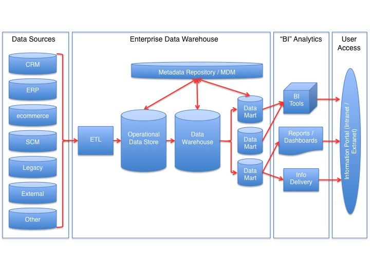

# Data Architecture

<ol>
 <li><a href='./prj2/Readme.md'>Project: Effect of Weather on Restaurant Reviews</a>
 <li> 
</ol>

<table>
 <tr><td>
  
 </td></tr> 
 <tr><td>
  Figure: Datawarehouse Reference Architecture
 </td></tr> 
</table>

## References
<ul>
 <li> <a href='https://www.dama.org/cpages/body-of-knowledge'>DAMA DMBoK 2</a> https://www.dama.org/cpages/body-of-knowledge
 <li> <a href='https://dl.acm.org/doi/book/10.5555/77708'>The relational model for database management: version 2, E. F. Codd</a>
 <li> <a href='https://www.amazon.com/Data-Warehouse-Toolkit-Definitive-Dimensional/dp/1118530802/'>The Data Warehouse Toolkit: The Definitive Guide to Dimensional Modeling, 3rd Edition 3rd Edition</a>
 <li> <a href='https://www.amazon.com/dp/163462887X'>The Unified Star Schema: An Agile and Resilient Approach to Data Warehouse and Analytics Design</a>
</ul>
