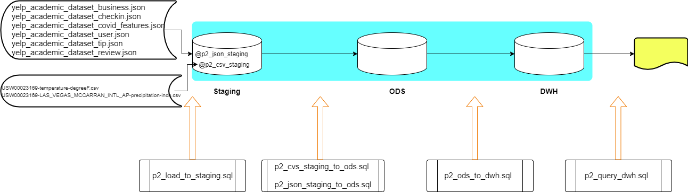

# Project: Effect of Weather on Restaurant Reviews

In this project, we are attempting to find out the impact of weather conditions on customers’ review of restaurants. 
As input, 
<ol>
 <li> YELP data 
 <li> climate datasets for temperature and precipitation observations are from the Global Historical Climatology Network-Daily (GHCN-D) database. 
</ol>
<a href="http://www.snowflake.com" target='_blank'>Snowflake</a> is used as a cloud-native data warehouse system.
This project  architects and designs a Data Warehouse DWH for the purpose of reporting and online analytical processing (OLAP).

## Data Architecture 
This project comprise of three major steps;
<ol>
 <li> Loading files to staging area
 <li> Extracting data in files on staging area into tables in ODS
 <li> Transforming data in ODS to OLAP representations in DWH for reporting and analysis.  
</ol>

## References
<ul>
 <li> Yelp data sets, https://www.yelp.com/dataset/documentation/main
 <li> CLIMATE DATA, https://crt-climate-explorer.nemac.org/
</ul>
